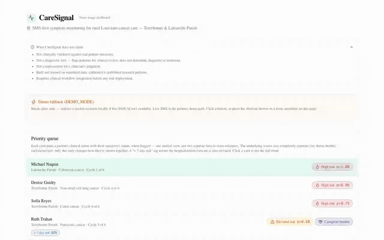
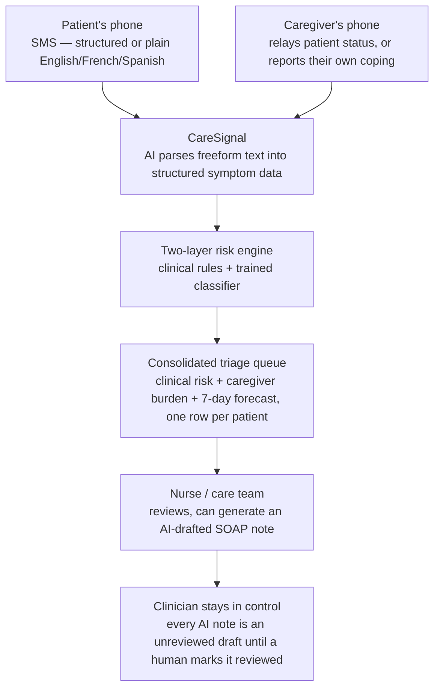
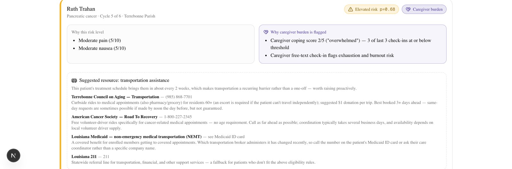

# CareSignal

**A text message tells a nurse when a chemo patient, or the person taking care of them, needs help before either of them has to call in.**

No app. No login. No smartphone required. Just a phone number.

<p align="center">
  
</p>

<p align="center">
  <sub>↑ Real, unedited screen recording of the running app, not a mockup. <a href="docs/demo-script.md">Full timed demo script</a> · <a href="#try-the-demo-yourself">Run it yourself in 3 commands</a></sub>
</p>

## Live demo

**Try CareSignal live:** _deployed URL goes here once published_ — no signup, no setup. Open it and click "Try the live demo" to walk through a real patient message, a real AI risk assessment, a real caregiver-burden alert, and a real clinical note draft.

---

## The problem

Someone starts chemotherapy, goes home, and for the next two or three weeks whatever their body does happens with nobody watching. A fever creeping up, pain getting worse, nausea that won't quit. The care team usually finds out at the next scheduled visit, or when things get bad enough that the patient calls in or ends up in the ER.

Daily symptom check-ins reviewed by a nurse is a real, validated way to catch problems earlier. It's not a new idea. What usually kills it in practice is **reach**: most versions require a smartphone, an app download, an account, and reliable data or wifi. In rural Terrebonne and Lafourche Parish, Louisiana, the real geography this project is grounded in, that's not a given for every patient on a chemo regimen.

There's a second, quieter problem most monitoring tools miss entirely: the person doing the day-to-day caregiving is under real strain too, and almost nothing tracks their capacity to keep going. A caregiver who burns out is a second point of failure for the patient's care.

## How CareSignal works



Every step above is real, running code, not a concept diagram. The AI layer parses text and drafts notes. It never decides treatment, and every hard clinical threshold (like a 100.4°F fever) is evaluated by plain, auditable rules that don't depend on any model.

## See it in action

The recording above is one continuous pass through the real app, in this order:

1. **Priority queue** — every patient's clinical status and their caregiver's status shown in the *same row*, not two lists to cross-reference.
2. **Caregiver burden, paired** — click into Ruth Trahan and her clinical "why" box sits directly beside her caregiver's "why" box. Two days earlier, her daughter Angela had texted: *"I don't know how much longer I can keep doing this... I'm exhausted."* That's a separate, purple-coded alert, never folded into Ruth's clinical score.
3. **Live model escalation** — a real click on the demo panel triggers Denise Guidry's check-in. Hard rules alone would only reach YELLOW. The trained classifier reads the *trend* and escalates her to RED (p=0.96), live, on screen.
4. **The hard safety floor** — Michael Naquin's 101.3°F fever fires a plain, interpretable rule (≥100.4°F, the real neutropenic fever threshold), independent of any model.
5. **AI-drafted SOAP note** — one click turns his check-in history into a Subjective/Objective/Assessment/Plan note, generated live against a real API. It starts as an **unreviewed draft at the database level** and stays labeled that way until a clinician explicitly marks it reviewed.

<p align="center">
  
  <br/><sub>The pairing from step 2. Clinical risk and caregiver burden are computed completely separately and never blended into one score.</sub>
</p>

### Try the demo yourself

The fastest way to see CareSignal is the guided walkthrough at `/demo` once it's running (see [Live demo](#live-demo)). It sends a real seeded patient message through the real risk engine and shows the real result, no Twilio account or manual setup needed.

To run it locally:

```bash
npm install
npx prisma db push
npx tsx prisma/seed.ts
npm run dev
```

Set `DEMO_MODE="true"` in `.env` (see `.env.example`), open [http://localhost:3000](http://localhost:3000), and click "Try the live demo." The old dashboard fallback panel (click a scenario button, or press **Alt+1 / Alt+2 / Alt+3** anywhere on `/dashboard`) still works too. Full walkthrough: [`docs/demo-script.md`](docs/demo-script.md).

## Why CareSignal

This isn't a new clinical idea. Daily symptom monitoring with nurse triage is already validated in oncology research. The bet here is **reach and honesty**, not novelty:

- **SMS-only** — works on any phone, no app, no login, no data plan required.
- **Caregiver burden as a first-class signal** — the headline differentiator. Every other tool we looked at monitors the patient only. CareSignal gives the caregiver their own channel, their own alert type, and their own color, never merged into the patient's clinical score.
- **A real two-layer risk engine** — interpretable clinical rules (the safety floor, always auditable) plus a genuinely *trained* logistic-regression classifier that can escalate risk further, never downgrade it. Held-out performance: 0.78 recall / 0.68 precision, deliberately tuned toward catching more real escalations at the cost of some false alarms.
- **A separate 7-day hospitalization forecast** — a different model, a different question, never merged into the daily badge. In the seeded data, the patient with the highest forecast isn't the one with the worst symptoms. It's the one whose caregiver is burning out, which the model found on its own.
- **Trilingual** — English, French, and Spanish, verified live against the real model, including unprompted Celsius-to-Fahrenheit conversion.
- **A consolidated triage queue** — daily risk and the 7-day forecast merge into one notification per patient instead of two, cutting a nurse's review volume by roughly 20% at a realistic panel size.
- **AI-drafted clinical documentation, always human-reviewed** — SOAP notes start as an unreviewed draft at the database level, not a UI label, and the draft/reviewed status travels with the text wherever it's copied.
- **SDOH transportation nudges** — real, individually verified local transportation resources, surfaced only when a patient's treatment schedule makes travel a recurring barrier.
- **FHIR-lite export** — a patient's record as a real FHIR R4 bundle, validated against HL7's own reference validator.

**What CareSignal is not.** It does not diagnose patients, does not replace a clinician's judgment, and does not guarantee any outcome. Both risk models are trained on carefully calibrated *simulated* data, not real patient outcomes. This is disclosed directly on the dashboard itself, by default, not buried in a settings page. See [`docs/model-calibration.md`](docs/model-calibration.md) for the full, honest accounting of what has and hasn't been validated.

## Impact

A nurse managing 50–100 patients can't personally call each one every day. Daily SMS check-ins reviewed through a prioritized queue means the patients who need attention surface first, and the ones who are stable don't consume a nurse's time they don't need. Building it SMS-only means that queue can include the patient who doesn't have a smartphone or a data plan, not just the one who does. And treating caregiver exhaustion as its own tracked signal means a second crisis, the caregiver burning out, has a chance of being caught before it takes the patient's support system down with it.

## Technology

- **Framework:** Next.js 16 (App Router, TypeScript, Tailwind v4, shadcn/ui)
- **Database:** SQLite via Prisma ORM
- **SMS:** Twilio SMS API + webhooks
- **AI:** Groq (`openai/gpt-oss-120b`, OpenAI-compatible API) for freeform SMS parsing and SOAP note generation, handling English, French, and Spanish input
- **ML:** Two hand-trained logistic regression models (no external ML library), a daily symptom-risk classifier and a separate 7-day hospitalization-risk forecaster, both trained on simulated data; see [`docs/model-calibration.md`](docs/model-calibration.md)
- **Charts:** Recharts
- **Testing:** Vitest (143 unit + integration tests against a dedicated test DB) plus a custom concurrency/load test

## Run locally

```bash
npm install
npx prisma db push
npx tsx prisma/seed.ts
npm run dev
```

Then open [http://localhost:3000](http://localhost:3000).

Required environment variables (see `.env.example`):

- `DATABASE_URL` — SQLite file path, defaults to `file:./dev.db`
- `GROQ_API_KEY` — required for freeform SMS parsing and SOAP note generation
- `TWILIO_ACCOUNT_SID`, `TWILIO_AUTH_TOKEN`, `TWILIO_PHONE_NUMBER` — required only for live inbound SMS via `/api/twilio/inbound`
- `DEMO_MODE` — set to `"true"` to enable the local fallback described above (see `docs/pitch-notes.md`)

### Testing

```bash
npm test              # Vitest — unit + integration, dedicated test.db
npm run test:coverage # with a coverage report
npx tsx scripts/load-test.ts  # concurrency/load test against a live `npm run dev` server
```

The load test writes real numbers to `docs/load-test-results.md` and needs `npm run dev` running in another terminal. It writes into the actual seeded `dev.db`, so re-seed afterward (`npx tsx prisma/seed.ts`) to restore the clean demo baseline.

### Deploying

CareSignal uses SQLite as a real file on disk, so it needs a host that runs the app as a long-lived server with a persistent volume, not a stateless serverless platform. [Railway](https://railway.app) works well for this:

1. Connect the GitHub repo, let it build with `npm run build` and run `npm run start`.
2. Point `DATABASE_URL` at a path on Railway's persistent volume instead of the repo-relative default.
3. Set `GROQ_API_KEY`, `DEMO_MODE="true"`, and (optionally) the Twilio variables in Railway's environment settings. Never commit real credentials.
4. Once the volume is attached, run `npx prisma db push` and `npx tsx prisma/seed.ts` against it once so the deployed instance starts from the clean seeded baseline.

### What's in the dashboard

- **Consolidated triage queue** — daily clinical risk and 7-day hospitalization risk merged into one prioritized notification per patient, with source labeling (Patient SMS vs. Caregiver SMS vs. AI-parsed freeform).
- **Caregiver-burden alerts** — surfaced first, as their own alert type, never merged into clinical risk.
- **7-day hospitalization-risk forecast** — a separate model and panel from the daily risk badge, with its contributing factors listed.
- **AI-generated SOAP notes** — every note starts as an unreviewed draft with a computed confidence signal, and requires an explicit review action.
- **SDOH transportation card** — see `lib/transportationResources.ts`.
- **FHIR-lite export** — see `docs/fhir-validation-results.md`.
- **DEMO_MODE fallback panel** — replays the headline seeded scenarios locally if live SMS/AI isn't available mid-demo.

### Docs

- [`docs/demo-script.md`](docs/demo-script.md) — timed, word-for-word ~3-minute live demo script
- [`docs/pitch-notes.md`](docs/pitch-notes.md) — talking points and demo-day logistics
- [`docs/model-calibration.md`](docs/model-calibration.md) — training data, metrics, and validation plan for both risk models
- [`docs/load-test-results.md`](docs/load-test-results.md) — concurrency/load test results, including a real concurrency bug found and fixed
- [`docs/alert-volume-analysis.md`](docs/alert-volume-analysis.md) — computed nurse-triage notification volume estimates for a 50-100 patient panel
- [`docs/fhir-validation-results.md`](docs/fhir-validation-results.md) — round-by-round FHIR export validation results against HL7's real reference validator
- [`docs/known-behaviors.md`](docs/known-behaviors.md) — intentional-but-non-obvious behaviors found during manual testing, so they don't get mistaken for bugs

---

<sub>Built for the Ochsner Health / ASCO healthcare hackathon.</sub>
